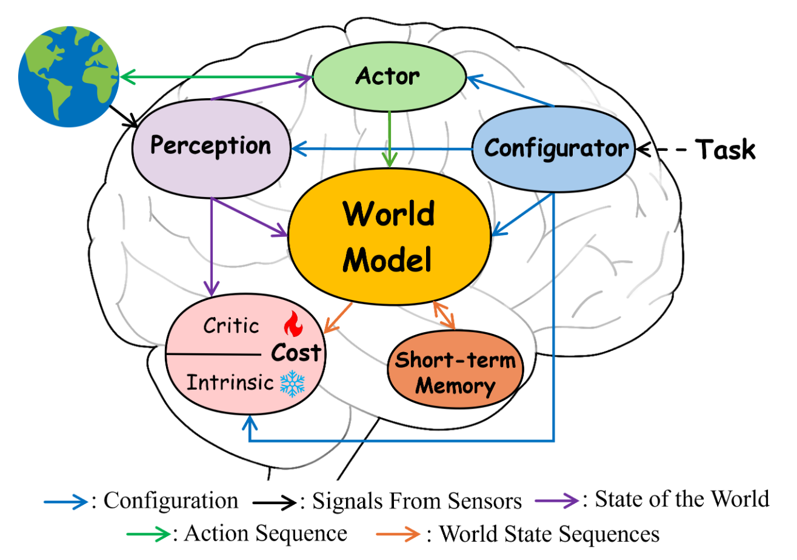

# II Preliminaries
## A. What Is the “World” to Be Modeled?
&emsp;&emsp;Despite the debate among philosophers about the ultimate nature of the world, the world can be roughly described as a set of entities, each with its own attributes or properties, along with the relationships and interactions that connect them. These attributes, such as shape, size, material, or state, and the connections, which can be spatial, causal, functional, or temporal, mean that objects, agents, and features are not only statically arranged but also evolve and influence one another over time. In order to interact effectively with such a world, an intelligent agent must capture critical information about entities, their properties, and their interactions. Collectively, these entities and interactions form a rich and dynamic environment in which an agent must actively explore, interact, and learn to achieve its goals. This naturally raises the question of what fundamental capabilities underpin an agent’s ability to capture and reason about such complex dynamics, as well as what forms of representation, learning, and interaction are required to model and act within an uncertain and evolving world.
## B. World Models Empowering Robot Intelligence
&emsp;&emsp;Embodied intelligence refers to a system’s ability to perceive, reason, and learn through direct interaction with its environment. Unlike traditional AI confined to abstract or symbolic domains, embodied intelligence integrates a physical body, sensors, actuators, and computational processes that together enable situated perception, reasoning, and action. Intelligent robotic agents serve as the primary physical instantiation of embodied intelligence. They inherently combine perception (via sensors), cognition (for learning and reasoning), and motor control (via actuators) to operate autonomously and acquire knowledge from real-world experience, much like biological organisms.  
&emsp;&emsp;However, because intelligent agents perceive only a partial and noisy projection of reality through their sensors, many underlying relationships and causal dependencies remain latent. This limitation makes structured internal representations essential for prediction, planning, and multi-step reasoning. To achieve robust and efficient embodied intelligence, recent research introduces the notion of world models, which serve as internal representations that capture environmental dynamics and common-sense regularities of how the world operates. By internally simulating potential outcomes, world models empower embodied agents to understand their context, anticipate the consequences of actions, and plan complex behaviors before execution, thereby reducing reliance on costly or unsafe real-world trial and error.
## C. Competing Perspectives on World Models
&emsp;&emsp;Although the concept of a “world model” is prevalent in computer science, its definition remains unsettled, with ongoing debate in the research community regarding its fundamental nature and role in intelligence [80]. A central point of contention concerns its generative capability, as illustrated by NVIDIA [81], who define world models as systems that learn environmental dynamics from multimodal data and generate videos capturing spatial and physical properties. Emphasizing action dependence, Sudhakar et al. [37], [40] characterize world models specifically as action-conditioned video generation models, distinguishing them from conventional video prediction. Similarly, Hafner et al. [14], [12], [13], [15], [82] identify action-conditioned prediction as a core feature of world models, emphasizing the prediction of latent representations rather than raw observations. Despite these differing perspectives, a common consensus emerges: world models aim to construct internal representations that capture environmental dynamics and action consequences, thereby enabling the prediction of future states.

<figure markdown>
  { width="80%" }
  <figcaption>Fig. 1. A visualization of an agent [11], where the world model predicts possible future world states as a function of imagined actions sequences proposed by the actor.</figcaption>
</figure>

## D. Revisiting Modern AI Models Through the Lens of World Modeling
&emsp;&emsp;The rapid progress of large-scale artificial intelligence models has blurred the boundaries between traditional task-specific learning and general world modeling. Although many of these models are not explicitly designed as world models, they exhibit key characteristics of world modeling, such as learning structured representations of reality, reasoning about causality, and predicting or generating plausible future states. Revisiting these modern models through the lens of world modeling provides valuable insights into how intelligence emerges from data, embodiment, and multimodal integration. This perspective helps clarify which components of contemporary architectures, such as large language models (LLMs), vision-language models (VLMs), vision-language-action models (VLAs) and video generation models, implicitly capture aspects of the world and how they contribute to the broader goal of generalpurpose world understanding. 

&emsp;&emsp;1) LLMs, VLMs & VLA  
&emsp;&emsp;The strong reasoning capabilities and next-token prediction mechanism of Large Language Models (LLMs) make them  natural foundations for constructing world models, as they capture sequential dependencies, causal relationships, and abstract dynamics. When equipped with auxiliary modules such as value functions [62] or modality-specific encoders [72], [54], [60], LLMs can achieve a more comprehensive understanding of the environment. Moving beyond the language-centric paradigm, Vision–Language Models (VLMs) focus on the joint modeling of multiple modalities, providing a perceptually grounded understanding of the world [83], [84]. Furthermore, an increasing number of studies have explored augmenting VLMs with low-level action-generation capabilities, thereby transforming them into Vision–Language–Action (VLA) models [16], [85], [44] that bridge perception, reasoning, and control. In addition to action generation, there are also many work that enable additional visual prediction [78], [79]. From the above discussion, the designs and functions of LLMs, VLMs, and VLAs align with the spirit of world models, as they aim to represent and reason about world dynamics. Therefore, these models should not be excluded from the broader conceptual scope of world modeling. However, solely relying on LLMs, VLMs, or VLAs often constrains a system’s capacity for long-horizon prediction, reasoning, and imagination, all of which are essential for modeling dynamic and interactive environments. Recent studies have thus begun to integrate these models into architectures that explicitly function as world models, such as the JEPA framework [27], Dreamerstyle frameworks [86], positioning them as core mechanisms for capturing temporal and causal dynamics. 

&emsp;&emsp;2) Video Generation Models.  
&emsp;&emsp;Video generation models primarily aim to produce visually realistic and temporally coherent sequences, which implicitly rely on learning the underlying dynamics of the environment. They can operate on diverse modalities, including language, visual data, and action inputs, allowing them to access environmental context and imagine future scenes. These characteristics position video generation models as a form of world modeling. Indeed, many recent world models adopt video generation as their core mechanism [5], [6], [7], enabling the prediction of future states encompassing observations, actions, and environmental changes. However, most video generation models focus on observation-level prediction and may lack interpretable internal representations of the world.

<figure markdown>
  { width="60%" }
</figure>
