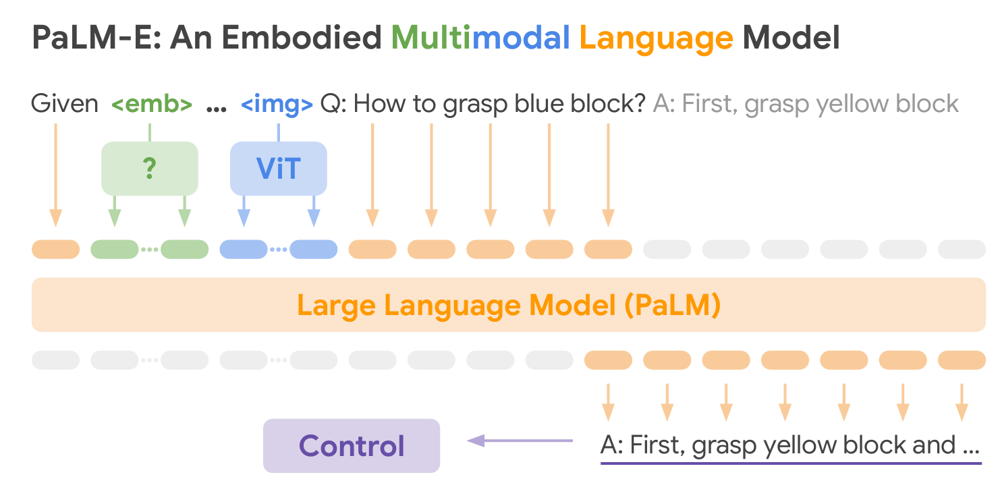

# III Overview of the World Model
“What we observe is not nature itself, but nature exposed to our method of questioning.” 

— Werner Heisenberg

## A. Paradigms
&emsp;&emsp;Building on the previous review of current models, contemporary architectures for capturing world dynamics can be broadly stratified along a methodological spectrum: implicit world modeling (e.g., LLMs, VLMs, and VLAs) [27], [87], [41], [85], latent dynamics modeling [14], [12], [13], [15], and video generation paradigms [6], [5], [7], [67], each targeting distinct representational granularities and predictive mechanisms.
<figure markdown>
  { width="80%" }
  <figcaption>Fig. 2. A visualization of LLM-based world models [54].</figcaption>
</figure>
&emsp;&emsp;1) Implicit World Modeling  
&emsp;&emsp;Representative models include LLMs, VLMs, and VLAs, which offer distinct advantages in semantic grounding, generalization, and interpretability [62], [72], [54], [60], [84]. An illustration of these models is shown in Fig. 2. At the same time, these models can be integrated into broader worldmodeling architectures to capture temporal dependencies and enable long-horizon prediction [16], [85], [44]. Detailed discussions of these models are provided in Sections II-D1 and IV-A1.

&emsp;&emsp;2) Latent Dynamics Modeling  
&emsp;&emsp;Latent dynamics models typically encode high-dimensional observations into compact latent states through a variational autoencoder (VAE) or encoder network, and employ recurrent or transformation modules (e.g., RNNs or Transformers) to predict the temporal evolution of these latent representations [12], [13], [14], [15]. This architecture is characterized by latent-space imagination and task-oriented optimization over visual granularity, facilitating long-horizon learning by forecasting future states without the need for pixel-level reconstruction.

vRecurrent State-Space Model (RSSM) [29] resembles the structure of a partially observable Markov decision process.  Its learning framework consists of three main components: an encoder, a decoder, and a dynamics model. The encoder network fuses sensory inputs (observations) o together into the stochastic representations z. The dynamics model learns to predict the sequence of stochastic representations by using its recurrent state s. The decoder reconstructs sensory inputs to provide a rich signal for learning representations and enables human inspection of model predictions, but is not needed while learning behaviors from latent rollouts. Specifically, at time step t, let the image observation be ot, the action vectors at and the reward rt. RSSM can be formulated as the generative process of the images and rewards conditioned a hidden state sequence st:  Encoder/representation model: st ∼ pθ (st | st−1, at−1, ot) Decoder/observation model: ot ∼ pθ (ot | st) Dynamics/Transition model: st ∼ pθ (st | st−1, at−1) Reward model: rt ∼ pθ (rt | st) (1)  

&emsp;&emsp;PlaNet [29] first demonstrates the effectiveness of learning dynamics in a latent space. The Dreamer family of models (a visualization is shown in Fig. 3) [12], [13], [14], [15] further verify this paradigm and establish a representative framework that reduces reliance on real-world data by performing imagination directly in latent space. Dreamer enables policy learning through imagined trajectories without continuous interaction with the environment, allowing agents to simulate multi-step consequences of actions and generalize to new states, objects, and environments.

&emsp;&emsp;While sharing the objective of learning predictive worldstate representations, Joint-Embedding Predictive Architecture (JEPA) [11], [27] and RSSM diverge fundamentally in their learning mechanisms. RSSM relies on generative reconstruction of observations to model latent dynamics, whereas JEPA (a visualization is shown in Fig. 4) employs selfsupervised predictive coding in embedding spaces—directly forecasting future state representations without decoding to raw sensory inputs. This paradigm eliminates the computational cost of pixel-level reconstruction but necessitates powerful hierarchical encoders to compress sufficient environmentalinformation into abstract embeddings, creating an implicit information bottleneck that demands careful architectural balancing to preserve task-relevant features. Under the JEPA framework, Assran et al. [77] combine pre-trained video models with an action-conditioned predictor to autoregressively predict future states and actions. 

&emsp;&emsp;The MuZero series [88], [89], [90] represent another form of latent-dynamics-based world modeling. Instead of modeling the complete environment dynamics, MuZero predicts only future quantities directly relevant to planning, such as rewards, values, and policies, given the complexity of real-world environments, and employs a tree-based search algorithm [91] to select optimal actions. 

&emsp;&emsp;3) Video Generation.  
&emsp;&emsp;Video-based generative models are powerful tools for capturing environmental dynamics and predicting future scenes. These models operate directly on high-dimensional raw observations, such as RGB images, depth maps, or force fields [6], [23], [19], [20], [92], [72], [93], [66], [94], treating the environment as a sequence of frames. By generating future scenes, they can support a wide range of applications, including visual planning, simulation, and action generation [63], [64], [6], [7], [67]. Moreover, they can leverage large-scale pre-training to enhance generalization and improve sample efficiency [67], [23], [67], [9], [38]. Depending on the input modality, world models can be constructed using action-conditioned video prediction models [6], text-to-video models [5], [19], [38], [66], or trajectory-to-video models [43], [58]. 

&emsp;&emsp;There are several architectural families of video-based world models. Diffusion-based world models generate videos by progressively denoising random noise through multiple iterative steps. Representative examples include U-Net-based models [95], [70] and diffusion transformer (DiT)-based architectures [25], [96], [43], [97], [10]. Autoregressive world models, in contrast, predict the next token or frame conditioned on previously generated ones, effectively modeling temporal dependencies in the sequence [57], [6], [72], [8], [26], [20], [58]. Other architectures include variational autoencoder (VAE)based models [20] and convolutional LSTMs [63], [64].  

&emsp;&emsp;Autoregressive-based world models generate each step conditioned on previous outputs, allowing them to predict sequences of arbitrary length and making them well-suited for long-horizon predictions. However, they often suffer from error accumulation over extended sequences [10] and may struggle to represent highly multi-modal distributions. In contrast, diffusion-based models generate samples through an iterative denoising process, enabling them to model complex, multi-modal distributions and produce globally coherent sequences. This iterative refinement also makes diffusion models more robust to individual prediction errors, resulting in better performance on tasks requiring long-horizon consistency or high-quality generative outputs. On the downside, diffusion models are computationally intensive and slower during inference, and adapting them to sequential prediction requires careful conditioning. Overall, autoregressive world models tend to excel in scenarios demanding speed and accurate short-term predictions, whereas diffusion models are more suitable for tasks involving long-horizon, multi-modal, or high-dimensional outputs where maintaining global coherence is crucial. 

&emsp;&emsp;Compared with implicit world models and latent-space world models, video generation models provide more detailed visual predictions but at a higher computational cost, lower generation speed and sample efficiency. In addition, action predictions are only proved to be align with visual future generation [73], as visual data contain relevant information to actions.

## B. Architectural Design

## C. World Observation and Representation

## D. Task Scope
